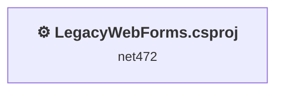
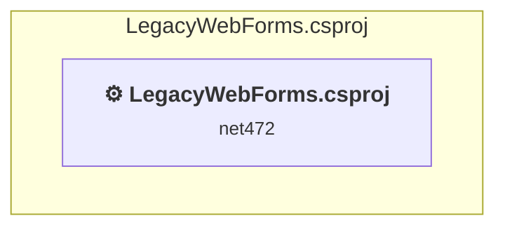

# Projects and dependencies analysis

This document provides a comprehensive overview of the projects and their dependencies in the context of upgrading to .NETCoreApp,Version=v10.0.

## Table of Contents

- [Executive Summary](#executive-Summary)
  - [Highlevel Metrics](#highlevel-metrics)
  - [Projects Compatibility](#projects-compatibility)
  - [Package Compatibility](#package-compatibility)
  - [API Compatibility](#api-compatibility)
  - [Binding Redirect Configuration](#binding-redirect-configuration)
- [Aggregate NuGet packages details](#aggregate-nuget-packages-details)
- [Top API Migration Challenges](#top-api-migration-challenges)
  - [Technologies and Features](#technologies-and-features)
  - [Most Frequent API Issues](#most-frequent-api-issues)
- [Projects Relationship Graph](#projects-relationship-graph)
- [Project Details](#project-details)

  - [LegacyWebForms.csproj](#legacywebformscsproj)

## Executive Summary

### Highlevel Metrics

| Metric | Count | Status |
| :--- | :---: | :--- |
| Total Projects | 1 | All require upgrade |
| Total NuGet Packages | 14 | 7 need upgrade |
| Total Code Files | 16 |  |
| Total Code Files with Incidents | 3 |  |
| Total Lines of Code | 510 |  |
| Total Number of Issues | 17 |  |
| Estimated LOC to modify | 0+ | at least 0.0% of codebase |

### Projects Compatibility

| Project | Target Framework | Difficulty | Package Issues | API Issues | Binding Issues | Est. LOC Impact | Description |
| :--- | :---: | :---: | :---: | :---: | :---: | :---: | :--- |
| [LegacyWebForms.csproj](#legacywebformscsproj) | net472 | 🔴 High | 11 | 0 | 3 |  | Wap, Sdk Style = False |

### Package Compatibility

| Status | Count | Percentage |
| :--- | :---: | :---: |
| ✅ Compatible | 7 | 50.0% |
| ⚠️ Incompatible | 6 | 42.9% |
| 🔄 Upgrade Recommended | 1 | 7.1% |
| ***Total NuGet Packages*** | ***14*** | ***100%*** |

### API Compatibility

| Category | Count | Impact |
| :--- | :---: | :--- |
| 🔴 Binary Incompatible | 0 | High - Require code changes |
| 🟡 Source Incompatible | 0 | Medium - Needs re-compilation and potential conflicting API error fixing |
| 🔵 Behavioral change | 0 | Low - Behavioral changes that may require testing at runtime |
| ✅ Compatible | 0 |  |
| ***Total APIs Analyzed*** | ***0*** |  |

### Binding Redirect Configuration

| Severity | Count | Description |
| :--- | :---: | :--- |
| 🔴Mandatory | 2 | Must be fixed to avoid runtime failures |
| 🟡Potential | 1 | May cause issues in certain scenarios |
| ***Total Binding Issues*** | ***3*** | ***Across 1 project(s)*** |

## Aggregate NuGet packages details

| Package | Current Version | Suggested Version | Projects | Description |
| :--- | :---: | :---: | :--- | :--- |
| Antlr | 3.5.0.2 |  | [LegacyWebForms.csproj](#legacywebformscsproj) | Needs to be replaced with Replace with new package Antlr4=4.6.6 |
| bootstrap | 5.2.3 |  | [LegacyWebForms.csproj](#legacywebformscsproj) | ✅Compatible |
| jQuery | 3.7.0 |  | [LegacyWebForms.csproj](#legacywebformscsproj) | ✅Compatible |
| Microsoft.AspNet.FriendlyUrls | 1.0.2 |  | [LegacyWebForms.csproj](#legacywebformscsproj) | ⚠️NuGet package is incompatible |
| Microsoft.AspNet.FriendlyUrls.Core | 1.0.2 |  | [LegacyWebForms.csproj](#legacywebformscsproj) | ⚠️NuGet package is incompatible |
| Microsoft.AspNet.ScriptManager.MSAjax | 5.0.0 |  | [LegacyWebForms.csproj](#legacywebformscsproj) | ⚠️NuGet package is incompatible |
| Microsoft.AspNet.ScriptManager.WebForms | 5.0.0 |  | [LegacyWebForms.csproj](#legacywebformscsproj) | ⚠️NuGet package is incompatible |
| Microsoft.AspNet.Web.Optimization | 1.1.3 |  | [LegacyWebForms.csproj](#legacywebformscsproj) | ⚠️NuGet package is incompatible |
| Microsoft.AspNet.Web.Optimization.WebForms | 1.1.3 |  | [LegacyWebForms.csproj](#legacywebformscsproj) | ⚠️NuGet package is incompatible |
| Microsoft.CodeDom.Providers.DotNetCompilerPlatform | 2.0.1 |  | [LegacyWebForms.csproj](#legacywebformscsproj) | NuGet package functionality is included with framework reference |
| Microsoft.Web.Infrastructure | 2.0.0 |  | [LegacyWebForms.csproj](#legacywebformscsproj) | NuGet package functionality is included with framework reference |
| Modernizr | 2.8.3 |  | [LegacyWebForms.csproj](#legacywebformscsproj) | ✅Compatible |
| Newtonsoft.Json | 13.0.3 | 13.0.4 | [LegacyWebForms.csproj](#legacywebformscsproj) | NuGet package upgrade is recommended |
| WebGrease | 1.6.0 |  | [LegacyWebForms.csproj](#legacywebformscsproj) | ✅Compatible |

## Top API Migration Challenges

### Technologies and Features

| Technology | Issues | Percentage | Migration Path |
| :--- | :---: | :---: | :--- |

### Most Frequent API Issues

| API | Count | Percentage | Category |
| :--- | :---: | :---: | :--- |

## Projects Relationship Graph

Legend:
📦 SDK-style project
⚙️ Classic project

## Project Details

### LegacyWebForms.csproj

#### Project Info

- **Current Target Framework:** net472
- **Proposed Target Framework:** net10.0
- **SDK-style**: False
- **Project Kind:** Wap
- **Dependencies**: 0
- **Dependants**: 0
- **Number of Files**: 99
- **Number of Files with Incidents**: 3
- **Lines of Code**: 510
- **Estimated LOC to modify**: 0+ (at least 0.0% of the project)

#### Dependency Graph

Legend:
📦 SDK-style project
⚙️ Classic project

### API Compatibility

| Category | Count | Impact |
| :--- | :---: | :--- |
| 🔴 Binary Incompatible | 0 | High - Require code changes |
| 🟡 Source Incompatible | 0 | Medium - Needs re-compilation and potential conflicting API error fixing |
| 🔵 Behavioral change | 0 | Low - Behavioral changes that may require testing at runtime |
| ✅ Compatible | 0 |  |
| ***Total APIs Analyzed*** | ***0*** |  |

#### Binding Redirect Configuration

| Rule | Severity | Details | Recommendation |
| :--- | :---: | :--- | :--- |
| Manual redirect conflicts with auto-generated version | 🔴Mandatory | Manual redirect for Newtonsoft.Json targets 13.0.0.0 but auto-generation would target 13.0.3 (MSB3836 conflict) | Remove the conflicting manual binding redirect or disable auto-generation. |
| Manual redirect conflicts with auto-generated version | 🔴Mandatory | Manual redirect for WebGrease targets 1.6.5135.21930 but auto-generation would target 1.6.0 (MSB3836 conflict) | Remove the conflicting manual binding redirect or disable auto-generation. |
| Binding redirect forces version downgrade | 🟡Potential | Binding redirect for Newtonsoft.Json targets 13.0.0.0 but package provides 13.0.3 | Update the binding redirect newVersion to match the version provided by the NuGet package. |

